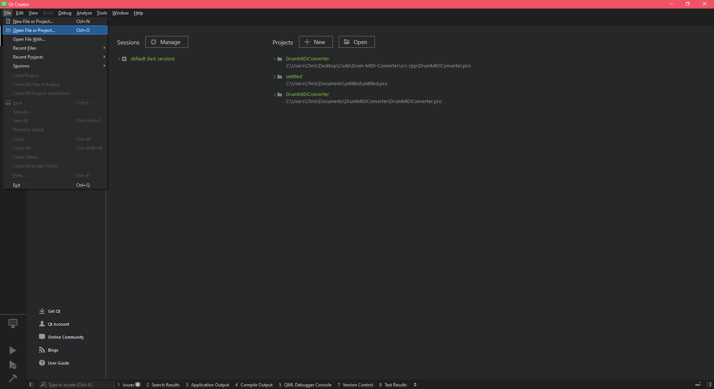
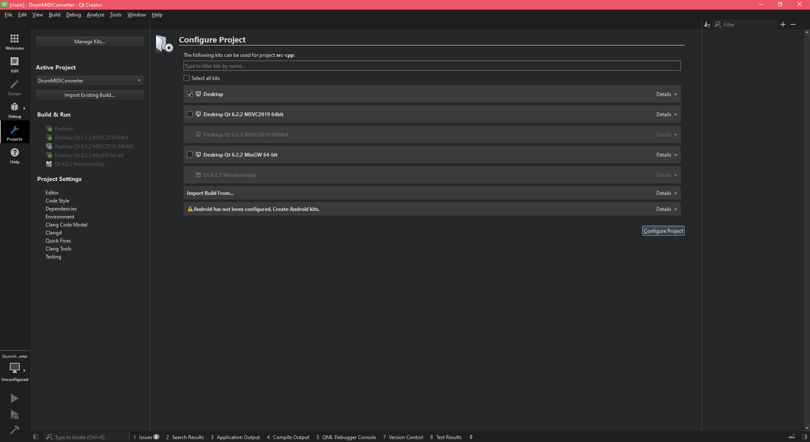

# Drum MIDI Converter
#### Free, open-source applications to convert between drum MIDI mappings 

This repository contains all of the source code necessary to build the Drum MIDI Converter. I will make a video explaining how to use it and explaining the backend. When I do, I will link it here.

This README is written for Linux systems, but can be run in any terminal that can use bash commands, assuming you have the following CLI tools installed:  
- python3
- git
- cmake
- make

# Table of Contents
- [Drum MIDI Converter](#drum-midi-converter)
      - [Free, open-source applications to convert between drum MIDI mappings](#free--open-source-applications-to-convert-between-drum-midi-mappings)
- [Build](#build)
  * [1. Clone the repository](#1-clone-the-repository)
  * [2. Build C++ Qt app](#2-build-c---qt-app)
    + [a. Download prerequisites](#a-download-prerequisites)
      - [i. [midifile](https://www.github.com/craigsapp/midifile) library by [craigsapp](https://www.github.com/craigsapp)](#i--midifile--https---wwwgithubcom-craigsapp-midifile--library-by--craigsapp--https---wwwgithubcom-craigsapp-)
      - [ii. [Qt & Qt Creator](https://www.qt.io/product/development-tools)](#ii--qt---qt-creator--https---wwwqtio-product-development-tools-)
    + [b. Build the project with Qt Creator](#b-build-the-project-with-qt-creator)
  * [3. Python Dash web app](#3-python-dash-web-app)
    + [a. Download prerequisites](#a-download-prerequisites-1)
      - [i. [Dash](https://plotly.com/dash/) by [Plotly](https://plotly.com)](#i--dash--https---plotlycom-dash---by--plotly--https---plotlycom-)
      - [ii. [mido](https://github.com/mido/mido)](#ii--mido--https---githubcom-mido-mido-)
    + [b. Run the Dash app](#b-run-the-dash-app)
- [Add your own drum mappings](#add-your-own-drum-mappings)
  * [1. Update the tree (if needed)](#1-update-the-tree--if-needed-)
    + [a. Update the tree folder](#a-update-the-tree-folder)
    + [b. Update the Keys namespace](#b-update-the-keys-namespace)
    + [c. Make sure none of the other mappings are broken](#c-make-sure-none-of-the-other-mappings-are-broken)
  * [2. Add mapping](#2-add-mapping)
    + [a. Add the function prototype to Mappings.hpp](#a-add-the-function-prototype-to-mappingshpp)
    + [b. Add function definition to new C++ source file](#b-add-function-definition-to-new-c---source-file)
    + [c. Update CMakeLists with the new source file](#c-update-cmakelists-with-the-new-source-file)
    + [d. Add the mapping to Mappings::getAllMappings() in Mappings.cpp](#d-add-the-mapping-to-mappings--getallmappings---in-mappingscpp)
    + [e. Update conversions.lkcmap (for the Python app)](#e-update-conversionslkcmap--for-the-python-app-)

<small><i><a href='http://ecotrust-canada.github.io/markdown-toc/'>Table of contents generated with markdown-toc</a></i></small>

# Build

## 1. Clone the repository

Clone this repository:

```git clone https://github.com/lotkey/Drum-MIDI-Converter```

I will refer to the cloned repo's directory as ROOT_DIR.

## 2. Build C++ Qt app

### a. Download prerequisites

#### i. [midifile](https://www.github.com/craigsapp/midifile) library by [craigsapp](https://www.github.com/craigsapp)

Clone the [midifile](https://www.github.com/craigsapp/midifile) library into ROOT_DIR/src-cpp/.
```bash
cd ROOT_DIR/src-cpp/
git clone https://www.github.com/craigsapp/midifile
```

Optionally, remove all the unnecessary stuff:
```bash
cd midifile
rm -rvf !("include"|"src")
rm src/Options.cpp
rm include/Options.h
```

You should have the following structure:  
```
ROOT_DIR  
├── ...  
├── src-cpp  
|   ├── mappings  
|   ├── midifile  
|   |   ├── include
|   |   ├── src
|   |   └── ...  
|   └── ...  
└── ...  
```

You may need to change the include paths in the following files:  
- MidiEvent.h  
- MidiEventList.h  
- MidiFile.h  
- Binasc.cpp  
- MidiEvent.cpp  
- MidiEventList.cpp  
- MidiFile.cpp  
- MidiMessage.cpp  

For example, change from:
```c++
#include "MidiFile.h"
#include "Binasc.h"
```

To:
```c++
#include "src-cpp/midifile/include/MidiFile.h"
#include "src-cpp/midifile/include/Binasc.h"
```

#### ii. [Qt & Qt Creator](https://www.qt.io/product/development-tools)

Download and install [Qt Creator](https://www.qt.io/product/development-tools). If any issues come up, I recommend following this [YouTube guide](https://www.youtube.com/watch?v=H2ud-ATLIdI):

[](https://www.youtube.com/watch?v=H2ud-ATLIdI)


### b. Build the project with Qt Creator

Open Qt Creator. On the top menu, select File > Open File or Project.


Open ROOT_DIR/src-cpp/DrumMIDIConverter.pro. If prompted, configure the project with a kit.


Build the project for your system. For Windows, you can follow [this tutorial](https://www.youtube.com/watch?v=rFHPOZoqzcg):
[](https://www.youtube.com/watch?v=rFHPOZoqzcg)

## 3. Python Dash web app

### a. Download prerequisites

#### i. [Dash](https://plotly.com/dash/) by [Plotly](https://plotly.com)

Install dash with the following command:
```bash
python3 -m pip install dash
```

#### ii. [mido](https://github.com/mido/mido)

Install mido with the following command:
```bash
python3 -m pip install mido
```

### b. Run the Dash app

Run the following command to run the Dash app:
```bash
python3 ROOT_DIR/src-python/app.py
```

# Add your own drum mappings

## 1. Update the tree (if needed)

If the mapping you are adding has kit pieces that are not in the tree, you will need to add some kit pieces to the tree. The [tree](src-cpp/mappings/tree) is located at ROOT_DIR/src-cpp/mappings/tree. This tree is used to generate the [Keys namespace](src-cpp/mappings/Parsing/Keys.hpp), which is used to create mappings.

RULES:
- Each root has it's own text file. These roots are completely separate, there is no crossover, and the kit pieces under one root cannot replace or substitute kit pieces under any other root.
- Defaults have an \*asterisk\* in the beginning of the name
- Indent with spaces, and keep the amount of spaces consistent in each text file

### a. Update the tree folder

Update the tree folder to fit your needs. This could include:
- Reorganizing the tree
- Adding kit pieces
- Creating roots

### b. Update the Keys namespace

I have included a program to automate updating the Keys namespace from the tree. You will need to build app from the source code and then run it.

To build the program:
```bash
cd ROOT_DIR/update-mappings/
cmake .
make
```

This will build an executable called "update." To update the Keys namespace with the current tree, run the following:
```bash
ROOT_DIR/update-mappings/update --keys
```

### c. Make sure none of the other mappings are broken

If you reorganized the tree or removed some kit pieces, the other mappings will not compile. You will need to update them to use the current Keys namespace.

## 2. Add mapping

### a. Add the function prototype to Mappings.hpp

[Mappings.hpp](src-cpp/mappings/Mapping/Mappings.hpp) is located at ROOT_DIR/src-cpp/mappings/Mapping/Mappings.hpp. It contains the Mappings namespace. This is where you should add your function prototype.

Conventions:
- Each company has its own namespace inside the Mappings namespace
- If a product has a single mapping, then it has a function inside the company's namespace named "get{product name}Mapping()"
- If a product has multiple mappings, then it has a namespace inside the company's namespace that will contains functions for each mapping, each with the name "get{product name}{mapping name}Mapping()"
- Every function takes no arguments and returns a Mapping

### b. Add function definition to new C++ source file

Each mapping has its own source file in the [Mappings folder](src-cpp/mappings/Mapping/Mappings) located at ROOT_DIR/src-cpp/mappings/Mappings/.

Conventions:
- Each company has its own folder inside the Mappings folder
- If a product has a single mapping, then it has a C++ source file inside the company's folder named "{product name}.cpp"
- If a product has multiple mappings, then it has a folder for the product with C++ source files inside for each mapping, each with the name "{mapping name}.cpp"

If you follow the conventions, then you must create a new source file. The source file will include some headers and define the function like so:

```c++
#include "../../../Parsing/Keys.hpp"
#include "../../Mapping.hpp"
#include "../../Mappings.hpp"
#include "../../../Midi/MidiNote.hpp"

Mapping Mappings::CompanyName::getMappingNameMapping() {
    return Mapping("CompanyName MappingName", {
        // Each mapping maps a key onto a group of notes
        // {Keys::..., {{Note::..., ...}, {Note::..., ...}}},
        // {Keys::..., {{Note::..., ...}}}
        // Here are some example mappings
        {Keys::Cymbal::Bell::Crash::_1, {{Note::A, 3}, {Note::D, 4}}},
        {Keys::Cymbal::Hit::China::_1, {{Note::F, 4}}}
    });
}
```

### c. Update CMakeLists with the new source file

The [CMakeLists](update-mappings/CMakeLists.txt) file is located at ROOT_DIR/update-mappings/CMakeLists.txt. Inside the add_executable part, add the path to the new source file.
```cmake
cmake_minimum_required(VERSION 3.13)
project(update)
set(CMAKE_CXX_STANDARD 20)

add_executable(update
    ${CMAKE_CURRENT_SOURCE_DIR}/update.cpp
    ${CMAKE_CURRENT_SOURCE_DIR}/../src-cpp/mappings/Helpers/stringpp.cpp
    ${CMAKE_CURRENT_SOURCE_DIR}/../src-cpp/mappings/Mapping/ConversionMap.cpp
    ${CMAKE_CURRENT_SOURCE_DIR}/../src-cpp/mappings/Mapping/Mapping.cpp
    ${CMAKE_CURRENT_SOURCE_DIR}/../src-cpp/mappings/Mapping/Mappings.cpp

    # Like so ---
    ${CMAKE_CURRENT_SOURCE_DIR}/../src-cpp/mappings/Mapping/Mappings/CompanyName/MappingName.cpp
    # -----------
    ${CMAKE_CURRENT_SOURCE_DIR}/../src-cpp/mappings/Mapping/Mappings/Drumforge/Bergstrand.cpp
    ${CMAKE_CURRENT_SOURCE_DIR}/../src-cpp/mappings/Mapping/Mappings/Drumforge/Ultimate.cpp
    ${CMAKE_CURRENT_SOURCE_DIR}/../src-cpp/mappings/Mapping/Mappings/GeneralMIDI/GmStandard.cpp

    ${CMAKE_CURRENT_SOURCE_DIR}/../src-cpp/mappings/Midi/MidiNote.cpp
    ${CMAKE_CURRENT_SOURCE_DIR}/../src-cpp/mappings/Midi/MidiNoteGroup.cpp
    ${CMAKE_CURRENT_SOURCE_DIR}/../src-cpp/mappings/Parsing/ParseTree.cpp
    ${CMAKE_CURRENT_SOURCE_DIR}/../src-cpp/mappings/Parsing/ParseTreeNode.cpp
    ${CMAKE_CURRENT_SOURCE_DIR}/../src-cpp/midifile/src/Binasc.cpp
    ${CMAKE_CURRENT_SOURCE_DIR}/../src-cpp/midifile/src/MidiEvent.cpp
    ${CMAKE_CURRENT_SOURCE_DIR}/../src-cpp/midifile/src/MidiEventList.cpp
    ${CMAKE_CURRENT_SOURCE_DIR}/../src-cpp/midifile/src/MidiFile.cpp
    ${CMAKE_CURRENT_SOURCE_DIR}/../src-cpp/midifile/src/MidiMessage.cpp
)
```

### d. Add the mapping to Mappings::getAllMappings() in Mappings.cpp

Add a line to [Mappings.cpp](src-cpp/mappings/Mapping/Mappings.cpp) located at ROOT_DIR/src-cpp/mappings/Mapping/Mappings.cpp.

```c++
#include "./Mappings.hpp"
#include "../Midi/Note.hpp"

// Converts from Yamaha standard to integer
uint8_t Mappings::yamahatoi(const Note& note, const int8_t& octave) {
    return 12 * (octave + 2) + (int)note;
}

std::map<std::string, Mapping> Mappings::getAllMappings() {
    using namespace Mappings;
    
    auto nameMapPair = [](const Mapping& map) {
        return std::pair<std::string, Mapping>(map.name(), map);
    };

    std::map<std::string, Mapping> map = {
        nameMapPair(Mappings::Drumforge::getBergstrandMapping()),
        nameMapPair(Mappings::CompanyName::getMappingNameMapping()) // like so
    };

    return map;
}
```

After that, the C++ app will be completely updated.

### e. Update conversions.lkcmap (for the Python app)

If you want the Python app to have the new mapping, you will have to update [conversions.lkcmap](src-python/conversions.lkcmap), located at ROOT_DIR/src-python/conversions.lkcmap. You can use the update program from earlier, but you will need to update that as well.

Update and run the update program:
```bash
cd ROOT_DIR/update-mappings/
cmake .
make
./update --cmaps
```

After that, the Python app will be completely updated.
